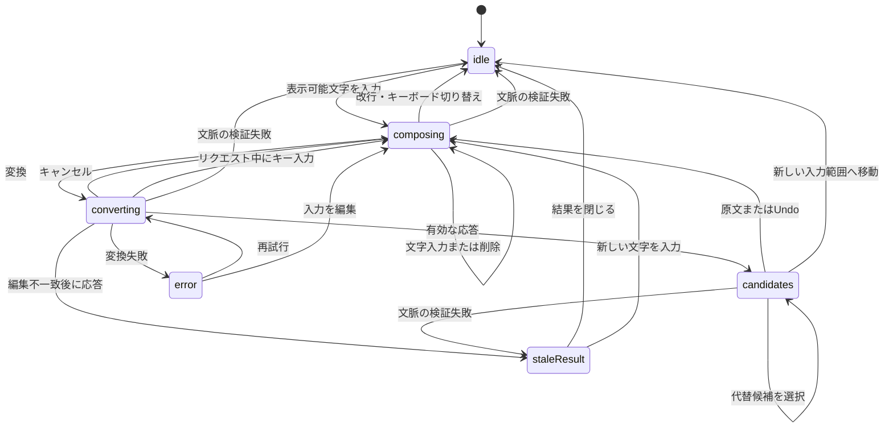

# Sumibi-iOS 設計書

## 1. 目的

Sumibi-iOSは、ローマ字または英語の文章をLLMで自然な日本語へ変換するiOSカスタムキーボードである。Emacs版Sumibiのモードレスな入力方式をiPhoneとiPadで実現する。

## 2. 製品原則

- 日本語入力をモードレスに保つ。利用者は英字QWERTY配列で入力し、明示的に変換を実行する。
- 変換を元に戻せるようにする。Undoで原文へ戻せなければならない。
- 外部サービスへ送るデータを最小限にし、ネットワーク利用を明確に説明する。
- LLMへのリクエスト中もキーボードの応答性を保つ。
- キーボードUI、変換処理、プロバイダー連携、設定保存を分離する。

## 3. MVPの範囲

### MVPに含める機能

- 英字QWERTYキーボード配列
- ローマ字および英語の入力
- 専用の変換キー
- LLMによる日本語変換
- 代替候補を表示する候補バー
- 原文へ戻すUndo
- OpenAI互換プロバイダーの設定
- コンテナアプリでのAPIキーおよびモデル設定
- キーボードの有効化と「フルアクセスを許可」の案内
- フルアクセス未許可、ネットワーク障害、タイムアウト、認証情報不正の明確なエラー表示

### 初回リリースに含めない機能

- フリック入力配列
- アンビエント変換
- ローカルMozcによる仮確定
- 日本語から英語への翻訳
- クラウド同期
- ユーザー辞書
- 音声入力

## 4. システム構成

### コンテナアプリ

役割：

- 初期設定およびキーボード設定手順の案内
- プロバイダー、エンドポイント、モデル、APIキーの設定
- プライバシーに関する説明と同意
- 変換テスト画面
- 入力内容を記録しない診断機能

### キーボード拡張

役割：

- QWERTYキーと候補バーの表示
- 現在のキーボードセッションで挿入した文字列の追跡
- 変換対象の決定
- 変換リクエストの開始とキャンセル
- 原文から選択候補への置換
- Undoによる原文の復元
- フルアクセスおよびネットワークエラーの案内

### SumibiCore

次の機能を持つ共通Swiftパッケージまたはフレームワーク：

- 変換リクエストとレスポンスのモデル
- ローマ字入力の追跡
- 変換対象の選択
- プロンプトの構築
- OpenAI互換HTTPクライアント
- 候補の解析
- 再試行、タイムアウト、キャンセルの方針
- プロバイダーに依存しないエラー型

### 共有設定

コンテナアプリとキーボード拡張は、機密情報ではない設定をApp Groupの`UserDefaults`で共有する。APIキーは共有UserDefaultsや共有ファイルへ保存せず、App Groupをアクセスグループとして利用する共有Keychainへ保存する。

APIキー共有の規則：

- APIキーの入力、更新、削除はコンテナアプリだけで行う。
- キーボード拡張は変換時の読み取りだけを行う。
- Keychain項目のアクセスグループには`group.org.sumibi.Sumibi-iOS`を明示する。
- 保護属性には`kSecAttrAccessibleWhenUnlockedThisDeviceOnly`を使う。
- `kSecAttrSynchronizable`を無効にし、iCloud Keychainで同期しない。
- 端末間のバックアップ移行を行わない。新しい端末ではAPIキーの再入力を求める。
- 「フルアクセスを許可」が無効な場合、キーボード拡張はAPIキーを取得・使用しない。
- APIキーをログ、エラー文、診断情報へ出力しない。
- Face IDまたはTouch IDによる毎回の認証は、IMEの操作性を損なうため要求しない。

識別子案：

- アプリのバンドルID：`org.sumibi.Sumibi-iOS`
- キーボード拡張：`org.sumibi.Sumibi-iOS.Keyboard`
- App Group：`group.org.sumibi.Sumibi-iOS`

これらの識別子は、Apple Developerアカウントの設定が確定するまでの仮案とする。

## 5. 変換の流れ

1. 利用者がSumibiキーボードでローマ字または英語を入力する。
2. キーボード拡張は、現在の有効な入力セッションで自ら挿入した文字列だけを記録する。
3. 利用者が変換キーを押す。
4. キーボード拡張が原文と限定された周辺文脈を取得する。
5. SumibiCoreが設定済みプロバイダーへ変換リクエストを送る。
6. 進行状況を表示している間も原文は表示したままにする。
7. 成功した場合、追跡中の原文を削除して第1候補を挿入する。
8. 候補バーに代替候補を表示する。
9. Undoで元の原文を正確に復元する。

カーソル移動、外部からの編集、キーボード切り替え、または文書コンテキストの不一致によって安全に置換できなくなった場合、追跡中の入力を無効化する。

## 6. キーボードUI

初期配列：

- 標準的な英字QWERTYの文字列
- Shift、削除、数字・記号、地球儀、空白、改行
- 視覚的に区別できる変換キー
- キー配列上部の候補バー

候補バーの状態：

- 待機中：短い案内を表示するか、候補バーを隠す
- 変換中：進行状況とキャンセルを表示する
- 成功：変換候補、代替候補、原文を表示する
- エラー：簡潔なメッセージと、必要に応じて再試行を表示する

## 7. ネットワークとプライバシー

変換ではネットワークサービスと共有設定を利用するため、キーボードには「フルアクセスを許可」が必要になる。設定アプリへ誘導する前に、コンテナアプリ内でその理由を説明する。

プライバシー規則：

- 利用者が変換キーを押した場合に限り、文字列を送信する。
- 送信する周辺文脈は、有用性を保てる最小量にする。
- キー入力や変換対象の原文をログへ永続化しない。
- 無関係なクリップボード、連絡先、位置情報、識別情報を収集しない。
- Sumibiが運営するサーバーでは変換リクエストを保持しない。
- 診断情報からAPIキーと入力内容を除外する。

既知のプラットフォーム制限：

- パスワードなどの安全な入力欄では、iOSが他社製キーボードをシステムキーボードへ置き換える。
- 一部の電話番号入力欄ではシステムキーボードが使われる。
- ホストアプリは他社製キーボードの利用を禁止できる。
- ネットワーク通信と共有コンテナへの書き込みには「フルアクセスを許可」が必要になる。

## 8. エラー処理

- フルアクセス未許可：リクエストを実行せず、設定手順を案内する。
- 設定不足：利用者をコンテナアプリへ誘導する。
- 認証エラー：API認証情報が無効であることを知らせる。
- レート制限：原文を保持し、再試行を提示する。
- タイムアウトまたはオフライン：原文を保持し、再試行できるようにする。
- キャンセル：原文を変更せずに元の状態へ戻す。
- 安全に置換できない状態：ホスト側の文字列を変更せず、候補だけを表示する。

## 9. テスト方針

- 対象検出、プロンプト生成、解析、エラー変換の単体テスト
- `URLProtocol`のモックを使ったプロバイダー通信テスト
- キーボード状態機械のテスト
- コンテナアプリのUIテスト
- 主要なホストアプリでの手動テスト
- フルアクセス許可あり・なしの実機テスト
- 入力内容と認証情報がログへ出力されないことを確認するプライバシーテスト

## 10. マイルストーン

1. ✅ アプリとキーボード拡張のターゲットを持つXcodeプロジェクト
2. ✅ App Groupの設定と共有設定
3. ✅ 文字の挿入と削除ができる最小QWERTYキーボード
4. 入力追跡と変換キー
5. モック変換クライアントと候補バー
6. OpenAI互換APIとの連携
7. Undo、キャンセル、エラー処理
8. 初期設定、プライバシー説明、実機検証

## 11. 未決事項

- 対応する最低iOSバージョン
- 最終的なバンドルIDとApp Group識別子
- 初期状態で使用するプロバイダーとモデル
- 周辺文脈の最大文字数
- 1回のリクエストで複数候補を返すか
- ライセンスとApp Storeのプライバシー申告

## 12. 変換対象と入力追跡

### MVPでの決定

MVPでは、現在のSumibiキーボードセッションが挿入し、引き続き管理している入力だけを変換する。ホストアプリの文書から任意の編集範囲を推測してはならない。

これは意図的にEmacs版より狭い仕様である。キーボード拡張は文書プロキシを通してカーソル周辺の限られた文字列を読み取れるが、ホスト文書そのものや安定した選択範囲を所有していない。置換対象を追跡中の入力に限定することで、カーソル移動やホスト側の編集後に無関係な文字列を削除する事故を防ぐ。

### 追跡する入力

`CompositionTracker`は次の情報を保持する：

- `source`：直近の確定境界以降にSumibiが挿入した正確な文字列
- `revision`：単調増加するローカル編集リビジョン
- `expectedSuffix`：カーソル位置の文脈を検証するための、長さを制限した末尾文字列
- `isReplaceable`：自動置換を引き続き安全に実行できるか

追跡処理は通常の表示可能文字を原文へ追加する。文書プロキシの文脈が一致している場合、削除キーは末尾の拡張書記素クラスタを1つ削除する。改行、キーボード切り替え、明示的なリセット、または変換成功後に追跡内容を消去する。

`watashi ha kiyoka desu .`のような句を一単位として変換できるよう、空白と句読点も入力対象に含める。改行を確定境界とする。リクエストが際限なく大きくなるのを防ぐため、MVPの変換対象は最大512文字とする。それより前の文字列は、読み取り専用の周辺文脈として利用できる。

### 安全性の検証

リクエスト開始前と置換直前の両方で、取得できた`documentContextBeforeInput`の末尾が`expectedSuffix`と一致することを確認する。置換直前の検証では、リクエスト開始時に取得したローカルの`revision`とも一致しなければならない。

どちらかの検証に失敗した場合：

- ホスト側の文字列を削除または置換しない。
- 返された候補は手動確認用として保持する。
- 入力内容が変更されたことを短いメッセージで知らせる。
- 結果をコピーまたは閉じられるようにする。
- 次のキー入力から新しい入力追跡を開始する。

この規則により、カーソル移動、ホストアプリからの編集、音声入力、テキスト置換、リクエスト中の追加入力を安全に処理できる。

### 置換

有効な結果を受け取った場合：

1. 追跡中の末尾文字列とリクエストのリビジョンを再検証する。
2. `source`に含まれる拡張書記素クラスタごとに`deleteBackward()`を1回呼び出す。
3. 選択された候補を挿入する。
4. 原文、置換結果、新しい期待末尾文字列を含む`UndoRecord`を保存する。
5. 変換中の入力追跡を消去する。

削除回数はUTF-16の長さではなく拡張書記素クラスタを基準にする。これにより、絵文字や結合文字によって削除回数が不正確になることを防ぐ。

### Undo

カーソルがSumibiの挿入した正確な置換結果の直後にある場合に限り、Undoを利用できる。同じ末尾文字列検証を行い、置換結果を拡張書記素クラスタ単位で削除して原文を再挿入する。無関係な挿入や削除、カーソル移動、キーボード切り替え、新しい変換のいずれかが発生した場合、`UndoRecord`を無効化する。

### MVPで明示的に対象外とする事項

- ホストアプリで選択した任意範囲の変換
- 文書プロキシの文脈から文書全体を再構築する処理
- 安全性の検証に失敗した後の文字列置換
- アンビエント変換

## 13. キーボード状態機械

UIとコントローラーは、1つの明示的な状態値を使用する。ネットワークのコールバックにはリクエストIDを持たせ、実行中のリクエストと一致しなくなった場合は無視する。

### 状態

- `idle`：追跡中の入力がない
- `composing`：追跡中の入力が有効で、変換を実行できる
- `converting`：1件のリクエストを実行中で、原文は未変更
- `candidates`：変換に成功し、代替候補を利用できる
- `staleResult`：変換には成功したが、原文を安全に置換できない
- `error`：原文を変更せずにリクエストが失敗した

### 状態遷移

| 現在の状態 | 事象 | 次の状態 | 処理 |
| --- | --- | --- | --- |
| `idle` | 表示可能文字の入力 | `composing` | 文字を挿入して追跡を開始する |
| `composing` | 表示可能文字の入力または削除 | `composing` | 挿入または削除を行い、リビジョンを増やす |
| `composing` | 変換 | `converting` | 検証してスナップショットを作り、リクエストを開始する |
| `converting` | キャンセル | `composing` | リクエストをキャンセルし、原文を保持する |
| `converting` | キー入力 | `composing` | リクエストをキャンセルまたは無効化し、応答性を保つ |
| `converting` | 有効な応答 | `candidates` | 第1候補へ置換し、Undo記録を作成する |
| `converting` | 編集不一致後の応答 | `staleResult` | ホスト側の文字列を変更しない |
| `converting` | 失敗 | `error` | 原文を保持して再試行を提示する |
| `error` | 再試行 | `converting` | 再検証して新しいリクエストを開始する |
| `candidates` | 代替候補を選択 | `candidates` | 現在のSumibi変換結果を安全に置換する |
| `candidates` | 原文またはUndo | `composing` | 正確な原文を復元する |
| すべて | 文脈の検証失敗 | `idle`または`staleResult` | 自動置換を無効化する |

### 並行処理の規則

- 自動置換を制御できるリクエストは同時に1件だけとする。
- 新しいリクエストを開始するときは、前のタスクをキャンセルしてリクエストIDを更新する。
- キャンセルは協調的に行い、遅れて届いた応答は無視する。
- Main Actor上で状態変更を直列化する。
- 進行状況を表示するためだけに原文を削除してはならない。
- 再試行では新しいリクエストIDを発行し、文書コンテキストを再検証する。

### 候補の挙動

モードレスなSumibiの操作感を保つため、有効な最初の応答を直ちに挿入する。その後、候補バーに代替候補と「原文」を表示する。別の候補を選択できるのは、現在挿入されている結果と期待末尾文字列が一致する場合に限る。一致しない場合は`staleResult`へ移行し、置換しない。

初期のAPI契約では、1回のリクエストにつき優先順位を付けた候補を最大3件返す。プロバイダーが候補を1件だけ返した場合でも、候補バーには「原文」を表示する。
